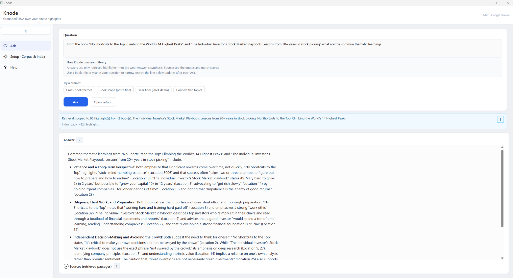

# Knode: Grounded answers across your personal knowledge

**Canonical MVP guide.**

Picture the highlights from books you have read on **Kindle**, the travel scraps your family keeps in **OneNote**, a photo of a menu you loved, or a voice memo after a hard day. **Knode** is built around a simple idea: ask in normal language, and get answers that **pull from your own saves** and **point back to them**, so themes connect across reading, notes, and plans instead of sitting in separate apps.

The **first version** proves that on **Windows** with **Kindle reading** you export into a local **`corpus.jsonl`**, then index and **Ask** with sources, using **Google Gemini**. **Down the road**, the same pattern extends to more of **your** repositories and formats (notes, documents, **images**, **audio**, **video**, and transcripts), still grounded in what you chose to keep.

---

## 1. Product: intent, personas, scenarios, requirements, success

### Elevator pitch

**Knode** is a **Windows desktop** assistant that answers **natural-language questions** about **your own Kindle reading** using **highlights and notes** you ingested into a local **`corpus.jsonl`**. Answers are **retrieval-grounded**: the model sees **your** passages first, then synthesizes with **citations** (book, location, quote). The wedge is **personal, citation-backed recall**, not generic web chat.

**Repository policy:** The **GitHub repo ships source and docs only**: **no `corpus.jsonl`**, no sample highlights. **`**/corpus.jsonl`** is gitignored at repo root. After clone or install, **every user** produces or selects their own corpus (see [§4](#4-corpus-install-and-first-run)).

### Problem

Highlights in [Kindle Notebook](https://read.amazon.com/notebook) are organized **by book**, but **themes span books**. Finding “what did I read about confidence?” across the library is slow; keyword search misses concepts. Users want **their** reading connected by topic **without** fabricated quotes.

### Primary persona (MVP)

**Alex, the returning reader**

- Reads on Kindle, highlights actively, reviews in Notebook.
- Wants: “What have I read about *X*?” before journaling, prep, or decisions.
- Expects **book-level references** on claims and, when retrieval supports it, **cross-book threads** (same theme, contrast, progression).
- Accepts a **practical** ingestion path today: **export / capture → structured file → app** (see [§4](#4-corpus-install-and-first-run)), while the **product language** still points at Notebook as source of truth.

### Scenarios (as shipped + near term)

| # | Scenario | Today (MVP) | Intent (spec / later) |
|---|----------|-------------|------------------------|
| 1 | **Get reading into the app** | Produce **`corpus.jsonl`** via WebView spike + `parse_dump` ([§4](#4-corpus-install-and-first-run)). | Background sync from Notebook when a supported automation path is validated (ToS / engineering). |
| 2 | **Topic query** | User asks in Knode; **retrieve** top passages from local index; **Gemini** `generateContent` with citations. | Same flow; richer **cross-book** narrative when clustering improves. |
| 3 | **Browse by book** | Supported at data level in JSONL; full Notebook-parity UI is backlog. | Notebook-aligned browse + “jump to related highlights.” |
| 4 | **Refresh corpus** | Re-run capture + parse when you add highlights; **rebuild index** in app. | Append + dedupe incremental sync. |

### Functional requirements (MVP: implemented vs gap)

| ID | Requirement | Status |
|----|-------------|--------|
| F1 | **Structured corpus** (`corpus.jsonl`, one highlight per line) | **Done** (`parse_dump`). |
| F2 | **Semantic search** over the user’s corpus | **Done** (Knode: Gemini embeddings + cosine; Python path: Chroma + MiniLM). |
| F3 | **Citation-first** answers | **Done** (prompt + sources panel). |
| F4 | **Local-first** reading data; clear **privacy** story for corpus | **Done** (file + local index); see security doc for API traffic. |
| F5 | **Amazon “connector”** via documented Notebook API | **Not available** publicly; **workaround** in [§4](#4-corpus-install-and-first-run). |
| F6 | **Installer / desktop** distribution | **Done** (Inno Setup + `build-installer.ps1`). |

### Non-goals (unchanged)

- Live Microsoft / Google / WhatsApp connectors in v1.
- Social, shared, or public corpora.
- Agents that act outside **read → reason → answer** (no calendar/email actions).

### Success criteria (MVP)

| Metric | Target |
|--------|--------|
| **Grounding** | For ~25 [golden questions](../eval/GOLDEN-QUESTIONS.md), ≥90% of factual claims supported by retrieved clips (human review). |
| **Citation usefulness** | Book + location + excerpt visible for non-obvious claims. |
| **Activation** | Median time from **having `corpus.jsonl`** to **first good answer** \< 15 minutes (install + index + ask). |

---

## 2. Design: options, choice, reasoning (succinct)

### What we wanted (official)

Programmatic, documented access to the **same** highlights the user sees in **Kindle Notebook**, ideally **OAuth + REST** (clear ToS, rate limits).

### What we verified

- No published **Kindle Notebook API** for third-party highlight export.
- [Login with Amazon](https://developer.amazon.com/docs/login-with-amazon/documentation-overview.html) is **identity**, not Notebook payloads.
- [Amazon Data Portability](https://developer.amazon.com/docs/amazon-data-portability/overview.html) **Kindle-related** scopes are **not** “export all Notebook highlight text” as of our review.

**Conclusion:** MVP must use **user-mediated or session-based** extraction, with **legal/ToS** review before any broad release.

### Options considered (abbreviated)

| Option | Idea | Why not primary |
|--------|------|-----------------|
| **A** Browser extension | Readwise-style; session on `read.amazon.com`. | Two deliverables + store review for v0. |
| **B** Embedded WebView | Session inside desktop app; capture text. | **Chosen for spike:** one artifact, same session model as extension. |
| **C** Playwright / Selenium | Automate browser. | Heavy, fragile, worse UX for most users. |
| **D** Email parsing | Digests from Amazon. | Incomplete coverage. |
| **E** File-only (`My Clippings.txt`, etc.) | No live Amazon interaction. | **Fallback / dev-friendly**; weaker “always fresh” story. |
| **F** Third-party API (e.g. Readwise) | Delegate ingestion. | Vendor lock-in; may conflict with local-corpus story. |

### Chosen path (MVP)

1. **Spike:** **Option B**: **WebView2** (`spike/webview-notebook`) to prove **login + readable capture** from Notebook.
2. **Normalize:** **Dedupe** captures → **`parse_dump`** → **`corpus.jsonl`** (deterministic, no DOM at query time).
3. **Ship:** **Knode** reads JSONL, **embeds** with **Gemini**, stores vectors under `%LocalAppData%\Knode\index\`, **answers** with **Gemini** chat.

**Reasoning:** Single installer story, offline replay of parsing from text, and **no** dependency on Amazon DOM at RAG time, only at export time. Extension remains the **upgrade** if WebView login grows painful.

---

## 3. Architecture: layers, data flow, technologies

**Deep dive (tiers, components, vector stores, Ask sequence):** [`KNODE-ARCHITECTURE.md`](KNODE-ARCHITECTURE.md)

### Layered view (static summary)

| Layer | Responsibility | Technologies |
|--------|----------------|--------------|
| **Presentation** | Browse corpus path, build index, ask question, show answer + sources | **WPF**, .NET 8 |
| **Application** | Orchestrate **embed batch**, **query embed**, **Top-K** retrieval, **RAG prompt**, config | **C#** in `dotnet/Knode` |
| **Local data** | **`corpus.jsonl`**, persisted **embeddings** (`vectors.bin`, `manifest.json`, `records.json`), optional **DPAPI** key blob | File I/O, local app data |
| **External AI** | Text embeddings + chat | **Google Gemini** (`gemini-embedding-001`, configurable chat model e.g. `gemini-2.5-flash`) |

**Optional Python path (prototyping):** same **`corpus.jsonl`** → **ChromaDB** + **sentence-transformers** + **`query_cli`**; **OpenAI** optional for synthesis only. See [`mvp/README.md`](../mvp/README.md).

---

## 4. Corpus, install, and first run

**You need a local `corpus.jsonl`** (one JSON object per line). It is **not** in git and **not** bundled in installers. Without a public Kindle Notebook API, a **dev or power-user** pipeline produces the JSONL contract the app expects.

**Typical pipeline (this repo):**

1. **WebView spike:** [`spike/webview-notebook/README.md`](../spike/webview-notebook/README.md) (Notebook login, per-book capture to `spike_extract.txt`).
2. **Dedupe:** `dedupe_spike_extract.py` → `spike_extract_deduped.txt`.
3. **Parse / validate:** from **`mvp/`**, run **`parse_dump`** and **`validate_corpus`** (see [`mvp/README.md`](../mvp/README.md)). Output: **`mvp/data/corpus.jsonl`**. **`validate_corpus`** exits **0** only when every row has a non-empty **`book_title`**; fix **`author`** gaps for best citations before indexing.
4. **In Knode:** browse to the JSONL, **Build index**; after corpus changes, use **Force full re-embed** if highlight **ids** shifted (see `parse_dump` and title hashing).

**Fallback:** Any tool that emits the **same JSONL shape** works; `My Clippings.txt` is valid **if** you convert to that shape.

**Runbooks (read in this order):**

1. **[`KNODE-INSTALL.md`](KNODE-INSTALL.md)**. Installer, prerequisites (.NET 8 Desktop Runtime, WebView2), SmartScreen.
2. **[`KNODE-FIRST-RUN.md`](KNODE-FIRST-RUN.md)**. Corpus path, API key, Build index, first Ask, troubleshooting.

**Also useful:** security and keys [`SECURITY-AND-RELEASES.md`](SECURITY-AND-RELEASES.md); engineer-oriented tiers [`KNODE-ARCHITECTURE.md`](KNODE-ARCHITECTURE.md); diary [`JOURNEY.md`](JOURNEY.md). Product vision and future sources: [§5](#5-vision-and-future-sources).

---

## 5. Vision and future sources

This section is the **public** north star. It stays high level so contributors and readers share the same direction without publishing private details.

### What we are building toward

The through-line is **your** material in, **cited** answers out: retrieval and reasoning stay anchored to snippets, files, or media you ingested, not the open web. Experiences stay **goal-directed** (scoped questions, cross-source synthesis) rather than an open-ended agent running your machine.

### Scenario themes (illustrative, not a commitment list)

- **Reading and big moments:** Connect highlights across books before a career or life decision; surface themes and tensions you already captured.
- **Family and travel notes:** Patterns across itineraries, preferences, pace, and places (e.g. from notes or planners you control), with answers tied to those entries.
- **Voice and text together:** Questions over transcripts, memos, and typed notes in one personal corpus, once ingestion supports them.
- **Video or talks plus reading:** Relate something you saved from a clip or lecture to a passage you highlighted, with pointers to both.
- **Cross-corpus bridges:** Link ideas between unrelated repositories you own (for example, a theme in reading and a pattern in trip notes).
- **Work knowledge:** Recall across meeting notes, specs, or exports you choose to ingest, with provenance on each claim.

Technical building blocks for engineers stay in [§3](#3-architecture-layers-data-flow-technologies) and [`KNODE-ARCHITECTURE.md`](KNODE-ARCHITECTURE.md).

### Private scenario notes (local only, not for GitHub)

Rich vignettes (real names, employers, trips, or exploratory copy) belong in a **local-only** markdown file, for example **`docs/VISION-SCENARIOS.local.md`**, and should **not** be committed. Filenames ending in **`.local.md`** are **gitignored** at repo root so you can iterate privately; keep the **canonical guide** to sanitized bullets here in §5.

---

## Revision log

| Date | Change |
|------|--------|
| 2026-04-09 | Story-style intro; §5 vision + public scenario themes; private **`*.local.md`** scenario notes + gitignore. |
| 2026-04-08 | Agentic product framing up front; §4 is corpus summary + INSTALL → FIRST-RUN order; long install/corpus runbooks moved to dedicated docs; em dash cleanup in this file. |
| 2026-04-07 | Hero screenshot; pointers to **KNODE-INSTALL** + **KNODE-FIRST-RUN** + **KNODE-ARCHITECTURE**; `validate_corpus` wording aligned with exit rules. |
| 2026-04-06 | Consolidated MVP-SPEC + ingestion decisions + ADR + runbooks into this file. |
